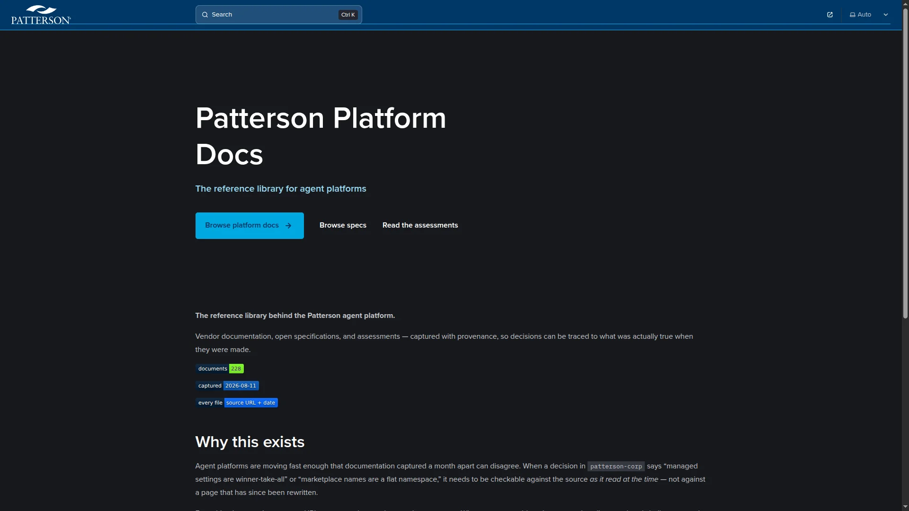

# patterson-platform-docs

**The reference library behind the Patterson agent platform.**

Vendor documentation, open specifications, and assessments — captured with provenance, so decisions can be traced to what was actually true when they were made.

---

## Live site

**[docs.patterson.sh](https://docs.patterson.sh)** — the reference library for agent platforms.

## Why this exists

Agent platforms are moving fast enough that documentation captured a month apart can disagree. When a decision in `patterson-corp` says "managed settings are winner-take-all" or "marketplace names are a flat namespace," it needs to be checkable against the source *as it read at the time* — not against a page that has since been rewritten.

Everything here carries a source URL, a capture date, and a completeness note. Where a page could not be captured — client-rendered shells, truncated schemas — that is recorded too, rather than silently omitted.

> [!NOTE]
> This is a **reference library, not an authority.** The cited originals remain the source of truth. Local copies exist for availability and traceability.

## Index

### `references/platforms/` — vendor documentation

Captured 2026-08-11. See [`_SOURCES.md`](references/platforms/_SOURCES.md) for the full URL table and per-file status.

| Area | Files | Highlights |
|---|---|---|
| [`claude-code/`](references/platforms/claude-code/) | 28 | `plugin-marketplaces`, `settings` (precedence + managed tier), `hooks`, `skills`, `sub-agents`, `mcp`, `env-vars` |
| [`copilot/`](references/platforms/copilot/) | 18 | Org/enterprise policy cascade, custom instructions, `copilot-instructions.md`, coding-agent config |
| [`vscode/`](references/platforms/vscode/) | 18 | Agent plugins, agent harnesses, managed settings, profiles, MCP |

Two distilled files are worth reading first — they extract only the normative content:

- [`vscode/_NORMATIVE-agent-plugins.md`](references/platforms/vscode/_NORMATIVE-agent-plugins.md) — the four plugin formats, their manifest paths and root tokens, and the settings keys VS Code shares with Claude Code
- [`vscode/_NORMATIVE-agent-harnesses.md`](references/platforms/vscode/_NORMATIVE-agent-harnesses.md) — session targets, isolation modes, and what constrains MCP in the Copilot harness

### `references/specs/` — open standards

| Spec | Version captured | Notes |
|---|---|---|
| [`agent-skills/`](references/specs/agent-skills/) | *no version string* | `SKILL.md` frontmatter rules. Versioned only by site git history — worth knowing before depending on it |
| [`agent-plugins/`](references/specs/agent-plugins/) | `1.0.0` Working Draft | Root `plugin.json`, closed schemas, `${PLUGIN_ROOT}` / `${PLUGIN_DATA}` |
| [`mcp/`](references/specs/mcp/) | `2026-07-28` | The first breaking redesign. There is no literal "v2" — this revision is what people mean |
| [`mcp-apps/`](references/specs/mcp-apps/) | ext `2026-01-26` | UI resources and host integration |
| [`stitch-design-md/`](references/specs/stitch-design-md/) | — | Google Stitch `DESIGN.md` — the five-section structure and authoring rules |
| [`acp/`](references/specs/acp/) | — | Agent Client Protocol — editor ↔ agent |
| [`ahp/`](references/specs/ahp/) | — | Agent Host Protocol — channels, lifecycle, transport |
| [`a2ui/`](references/specs/a2ui/) | — | Agent-to-UI schemas |

> [!WARNING]
> `specs/mcp/schema.json` is **truncated** — the upstream file is ~181KB / 3963 lines / 155 `$defs`; fetching capped at ~132KB. The prefix was verified byte-identical to the baseline. Documented in [`specs/mcp/README.md`](references/specs/mcp/README.md).

### `references/assessments/` — analysis

Written against the material above. These carry judgments, not just facts — read them as of their date.

| Document | What it covers |
|---|---|
| [`dual-manifest-pattern.md`](references/assessments/dual-manifest-pattern.md) | How one source tree serves Claude, Copilot, and VS Code. **The key finding: the two marketplace manifests are byte-identical — projection is a copy, not a transformation.** |
| [`agentics-and-gh-aw.md`](references/assessments/agentics-and-gh-aw.md) | GitHub Agentic Workflows: the compiler, the permission model, and a Patterson adoption path |
| [`patterson-sh-inventory.md`](references/assessments/patterson-sh-inventory.md) | Every reusable asset in prior work, with KEEP / ADAPT / DISCARD verdicts |
| [`existing-repos-assessment.md`](references/assessments/existing-repos-assessment.md) | Verdicts on the legacy `patterson-agents` repositories |
| [`_SOURCES.md`](references/assessments/_SOURCES.md) | Everything read to produce the above |

### `references/prototypes/` — superseded work, kept for traceability

[`agent-platform-scaffold/`](references/prototypes/agent-platform-scaffold/) — the original multi-repo scaffolding prototype. Superseded by the shipped platform, but its `references/` explain constraints that still hold, particularly the GitHub organization boundary and content resolution order.

### `decisions/` — ADRs

Architecture decision records for the platform. See also `patterson-corp/docs/decisions/`.

## Conventions

| | |
|---|---|
| **Provenance header** | Every captured file opens with source URL, capture date, and completeness |
| **`_SOURCES.md`** | Per-directory table: URL, local path, version, status (`ok` / `partial` / `blocked`) |
| **Gaps recorded** | A page that could not be captured is listed as such, never silently dropped |
| **No rewriting** | Captured content is preserved as fetched. Analysis lives in `assessments/`, separately |

## Refreshing

These are point-in-time captures. Before relying on one for a decision, check its date against how fast that surface moves — Claude Code and VS Code agent documentation change frequently; the open specs less so.

When re-capturing, preserve the old file rather than overwriting it if a decision cites it.

## Contributing and references

| File | Purpose |
|---|---|
| [`CONTRIBUTING.md`](CONTRIBUTING.md) | How to add or refresh a captured document while keeping the provenance convention intact |
| [`REFERENCES.md`](REFERENCES.md) | Index of every `_SOURCES.md` location — the authoritative table for each reference section |

---

Part of the <a href="https://github.com/patterson-agents">patterson-agents</a> platform · Distribute internally

